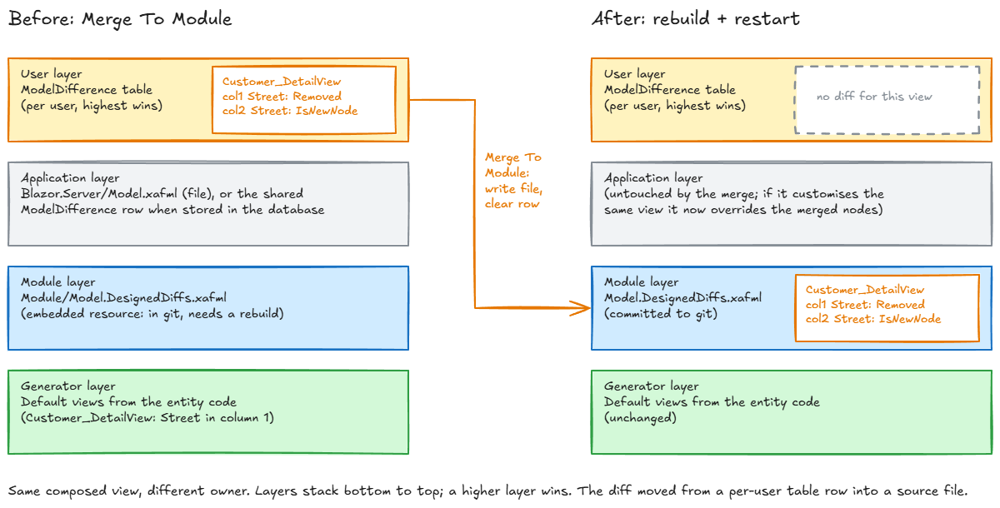

# XafMergerTool

A "save to source" button for the runtime layout designer in DevExpress XAF Blazor.

XAF Blazor lets users rearrange a DetailView at runtime (right-click, *Customize Layout*), and stores
the result per user in the `ModelDifference` table. That is fine for users, but useless for the
developer who wants that layout in the module's `Model.DesignedDiffs.xafml` and in git. WinForms has
the Model Editor and the Model Merge Tool for this. Blazor has nothing.

This repo answers one question: **can a running XAF Blazor app write a view's user-layer
customisations back into the module's xafml, so they become part of the source?**

**Yes.** One action, *Merge To Module*, on DetailView and ListView:

1. Takes the current view's diff out of the user layer.
2. Splices it into the module xafml at a configured path.
3. Removes it from the user layer, so nothing applies twice.

Rebuild, restart, and the view looks the same, now from source. The merged file opens in the Model
Editor untouched.

Since 2026-09-10 the runtime also offers the Model Editor's view options that Blazor has no UI for,
so an administrator can shape them and the developer merges the result:

| Model Editor | Runtime action | Writes |
|---|---|---|
| ListView > MasterDetailMode, SplitLayout > Direction / ViewsOrder | *Master-Detail* (No Master-Detail, Detail Right / Below / Left / Above) | `MasterDetailMode`, `SplitLayout` |
| ListView > MasterDetailView | *Detail View* | `MasterDetailView` |
| Views > add DetailView / ListView, generate content, Variants > Add | *Save As Variant* | a complete new view node, `Variants` on the root view |
| Variants > delete | *Delete Variant* (runtime-created variants only) | removes both again |

These actions are active for a role with `IsAdministrative` or `CanEditModel`; *Merge To Module*
stays developer-only. Plan and decisions: [docs/ME-AT-RUNTIME-PLAN.md](docs/ME-AT-RUNTIME-PLAN.md).

It is not runtime editing and it is not for production. It only makes sense on a developer machine
with the source checked out, and that is the point.

**To be clear about what "writes to source" means:** the Blazor Server process opens the module's
`Model.DesignedDiffs.xafml` on its own disk and rewrites it. That is the file in your working tree
when you run the app from Visual Studio or `dotnet run`, so you review the diff and commit it. The
running app does not pick the change up: the module xafml is compiled in as an embedded resource, so
you rebuild and restart to see the layout come from source. Deployed anywhere else, the action would
write into a file nobody reads, which is why it is gated behind `Debugger.IsAttached` or a config flag.

## Try it

Needs DevExpress 26.1 (XAF Blazor), .NET 10 SDK, SQL Server LocalDB.

```
cd C:\projects\XafMergerTool\XafMergerTool\XafMergerTool.Blazor.Server
dotnet run
```

Log in as `Admin`, no password. Open *Customer*, open *Acme BV*, right-click empty layout space,
*Customize Layout*, drag *Street* into the second column, close the customization form. Then
*Tools > Merge To Module*. Look at `XafMergerTool.Module\Model.DesignedDiffs.xafml`: the
`Customer_DetailView` node is there. Rebuild and restart: the layout survives, and the
`ModelDifferenceAspect` row for Admin no longer mentions the view.

The action is visible when `Debugger.IsAttached` or `XafModelMerge:Enabled` is true;
`appsettings.Development.json` turns it on.

**Master-detail list:** open *Customer*, *Tools > Master-Detail > Detail Below*. The list re-creates
itself with the selected customer's form under it. *Tools > Merge To Module*, rebuild, restart: the
split now comes from `Customer_ListView` in the module xafml (`MasterDetailMode`, `SplitLayout`).

**Second layout as a variant:** open *Acme BV*, *Tools > Save As Variant*, caption `Compact`. The
form now shows the copy (`Customer_DetailView_Compact`) and the *View* combo on the Home tab lists
*Default* and *Compact*. Rearrange it with *Customize Layout*, then *Tools > Merge To Module*: the
variant and the root's `Variants` node land in the xafml, the frame goes back to the default view.
Rebuild, restart, open *Acme BV*: it opens in *Compact* (the module's `Current`), and the combo
switches between the two. *Delete Variant* removes a variant that has not been merged yet.

## Put it in your own app

See [docs/HOW-TO-IMPLEMENT.md](docs/HOW-TO-IMPLEMENT.md). Three files to copy, one config section,
about fifteen minutes; four more files and the ViewVariants module if you want the runtime
master-detail and variant actions too.

## What is in the box

| Path | What |
|---|---|
| `XafMergerTool.Module/ModelMerge/XafmlViewMerger.cs` | The XML splice. Pure `System.Xml.Linq`, no XAF dependency. |
| `XafMergerTool.Blazor.Server/Controllers/MergeToModuleController.cs` | The action. Reads the user layer, calls the splice, clears the layer. Knows variants. |
| `XafMergerTool.Blazor.Server/Controllers/ListViewSettingsController.cs` | *Master-Detail* and *Detail View* actions on root ListViews. |
| `XafMergerTool.Blazor.Server/Controllers/SaveAsVariantController.cs` | *Save As Variant* and *Delete Variant* on root object views. |
| `XafMergerTool.Module/ModelMerge/UserLayer.cs` | The user layer: find it, serialise a view's diff, tell a runtime-created view, clear stale aspect rows. |
| `XafMergerTool.Module/ModelMerge/ModelEditingGuard.cs` | Who may use the runtime actions: `IsAdministrative` or `CanEditModel`. |
| `XafMergerTool.Module/ModelMerge/SaveAsVariantParameters.cs` | The caption popup for *Save As Variant*. |
| `XafMergerTool.Module/BusinessObjects/` | `Customer` and `Order`, a DetailView worth rearranging. |
| `XafMergerTool.E2E/` | The gate (C# Playwright, NUnit) and one unit check for the splice. |
| `docs/DESIGN.md` | The mechanics, with the DevExpress source lines they come from. |
| `docs/HOW-TO-IMPLEMENT.md` | Adding the action to an existing XAF Blazor app. |

## How the merge works



The diff moves from the per-user row in the `ModelDifference` table into the module's xafml. The
composed view is the same; what changed is which layer owns it. Source: `docs/merge-layers.excalidraw`.

1. The user layer is `((ModelApplicationBase)Application.Model).LastLayer` (Id `UserDiff`). The
   action serialises it with XAF's own `ModelXmlWriter`, the same call `ModelDifferenceDbStore`
   uses to persist it, and takes `Views/*[@Id=<view>]`.
2. The element is merged into the module xafml node by node, the way XAF's own `ModelNode.MoveNode`
   moves a layer's node down: for every node the diff mentions, its values and `IsNewNode`/`Removed`
   state win; nodes and values the diff does not mention stay. Three places where XAF's move would
   drop a `Removed` marker keep it here, because the user layer is cleared afterwards and the module
   must carry the suppression itself. State table and deviations: `docs/MERGE-003-PLAN.md`.
3. `((ModelNode)View.Model).Undo()` drops the user layer's subtree for the view, the same call
   XAF's *Reset View Settings* makes, and `SaveModelChanges()` persists that.
4. `ModelDifferenceDbStore.SaveDifference` skips an aspect whose XML is empty, so a user layer that
   just lost its only diff would keep stale XML in the table. The action writes an empty
   `<Application/>` into such rows itself, under the same version guard the store uses.

Reviewed against the DevExpress 26.1 source by a second pass (Codex, 2026-09-09); the guards in
the controller came out of that review.

## The gate

`XafMergerTool.E2E/MergeRoundTripTests.cs`, four tests, plus twelve marker checks on the splice in
`XafmlViewMergerTests.cs`. The first round trip:

1. Log in, open the Customer DetailView, assert the default two-column layout.
2. Right-click empty layout space, *Customize Layout*, drag *Street* from column 1 onto *Country*
   in column 2, close the customization form.
3. *Tools > Merge To Module*. Assert the module xafml has the layout node and the
   `ModelDifferenceAspect` table does not.
4. Kill the app, `dotnet build`, restart, log in again, assert *Street* is in column 2 via the DOM
   and the table still has no diff for the view.

The second repeats the cycle, then moves *Street* back and merges again on top of the module's diff,
restarts, and asserts the default layout: the node-by-node merge composes correctly.

The third picks *Detail Below* on the Customer list, asserts the split (`.xaf-masterdetail-container
.direction-vertical`), merges, restarts, and asserts the split comes from the module. The fourth
saves *Compact* as a variant, moves *Street* in it, merges, asserts the variant node and the root's
`Variants` in the xafml and a clean user layer, restarts, and asserts *Compact* opens by default and
the *View* combo switches back to the default layout.

The tests host the app themselves (build it, start the exe on port 5000, kill it), reset state first
(removes the view from the xafml, empties the ModelDifference tables), and restores the original
xafml afterwards. Needs LocalDB and the source tree.

```
cd C:\projects\XafMergerTool
dotnet test XafMergerTool\XafMergerTool.E2E
dotnet test XafMergerTool\XafMergerTool.E2E --settings XafMergerTool\XafMergerTool.E2E\headed.runsettings
```

Playwright's Chromium must be installed once after the first build:
`powershell -File XafMergerTool\XafMergerTool.E2E\bin\Debug\net10.0\playwright.ps1 install chromium`.

**Model Editor check (manual, done 2026-09-09):** the merged `Model.DesignedDiffs.xafml` opened in the
standalone Model Editor 26.1 with Save disabled, closed without a save prompt, and the file hash was
identical before and after. Open it with:

```
"C:\Program Files\DevExpress 26.1\Components\Tools\eXpressAppFrameworkNetCore\Model Editor\DevExpress.ExpressApp.ModelEditor.v26.1.exe" ^
  C:\projects\XafMergerTool\XafMergerTool\XafMergerTool.Blazor.Server\bin\Debug\net10.0\XafMergerTool.Module.dll ^
  C:\projects\XafMergerTool\XafMergerTool\XafMergerTool.Module
```

Pass the module DLL from the *Blazor.Server* bin: the module's own bin has no dependency DLLs and the
ME fails with "Could not load file or assembly DevExpress.Persistent.BaseImpl.EFCore".

## Limitations, on purpose

- **Developer machine only.** The action writes to a source file at a configured path; it needs the
  source checked out and a rebuild afterwards because the module xafml is an embedded resource.
- **Per view only.** Whole-model merge is where the layer semantics get ugly; not attempted.
- **Views only.** Navigation, actions, localisation and anything else outside `Views` are out of scope.
- **No conflict handling.** Last write wins per node: for a node the diff mentions, the user layer's
  values and state replace the module's; nodes the diff does not mention are left alone.
- **Default aspect only.** Only aspect 0 (unlocalised) is merged. If the user layer also holds a
  localised diff for a module-defined view, the action refuses instead of dropping it (`Undo()`
  clears all aspects). Variant captions are written to the default aspect for this reason.
- **Split layout needs `DxGridListEditor`.** The *Master-Detail* action hides on other list editors
  and in lookup popups; Blazor renders the split only there (docs 113249).
- **Runtime-created views are merged whole and then removed.** A view the user layer created (*Save As
  Variant*) carries `IsNewNode` and arrives in the module as a complete node; the action removes it from
  the user layer instead of `Undo()`, and its other aspects (the `CaptionColon` / `RequiredFieldMark`
  defaults XAF writes when it first shows a new DetailView) are dropped, not merged.
- **A variant brings its root's `Variants` node along, and nothing else of the root.** Merging a variant
  also merges the root view's `Variants` subtree from the user layer (the registration, captions and
  `Current`), then clears just that subtree. Merging a root view whose `Variants` still reference an
  unmerged runtime-created view is refused: open that variant and merge it first.
- **Admin variants stay in the admin's user layer until merged.** Save As Variant writes to the current
  user's model layer only; other users see the variant after Merge To Module and a rebuild. Sharing at
  runtime without a rebuild would be the shared model difference store, which is out of scope.
- **Canonical xafml only.** Node types are compared by element name. A hand-edited module file that
  uses the generic `Item` alias gets a needless type replacement, which discards that node's
  unspecified values and children.
- **Intervening layers.** A change the user made on top of the application project's `Model.xafml`
  (or a tenant layer) lands below it after the merge and can be overridden by it, in values and in
  structure. Merge into the highest file layer you own when that layer customises the same view.
- **Platform-specific content in the agnostic module.** The runtime reads it fine; the Model Editor
  opened on the platform-agnostic module alone shows Blazor-only properties and nodes as unusable.
- **One platform layer.** The diff lands in the platform-agnostic module. If it should be
  Blazor-only, point `ModuleXafmlPath` at `XafMergerTool.Blazor.Server/Model.xafml`.
- **Shared model differences in the database.** The Template Kit leaves `CreateCustomModelDifferenceStore`
  commented out; with it enabled, XAF imports the application project's `Model.xafml` into the
  `ModelDifference` table once (UserId empty) and ignores the file afterwards. Merging into the
  *module* xafml still works, because module differences load from assembly resources, not from that
  table. Merging into `Blazor.Server/Model.xafml` does not: the file is never read again unless you
  delete the shared row or use the administrative *Import Shared Model Difference* action. And an
  admin diff stored in that table for the same view sits above the module and wins.
- **Blazor only.** WinForms has the Model Editor and Model Merge Tool for this already.
