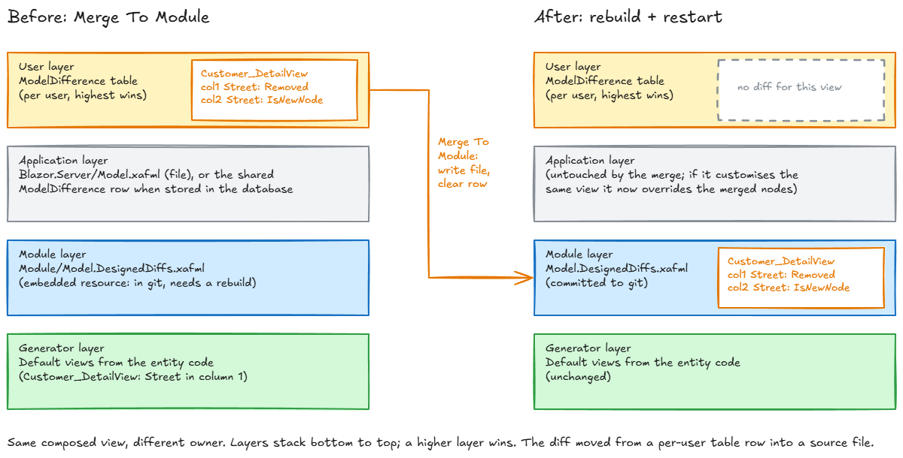

# How to add "Merge To Module" to your XAF Blazor app

Three files to copy for the merge itself, four more for the runtime Model Editor options (master-detail,
variants), one config section, one rule about rebuilding. Written against DevExpress
XAF 26.1; the model-layer API it relies on (`ModelApplicationBase.LastLayer`, `ModelXmlWriter`,
`ModelNode.Undo`, `ModelDifferenceDbStore`) has been stable across the 2x.x line, so older versions
should work but are untested.



## 1. Check the prerequisites

- **XAF Blazor with runtime layout customisation.** Right-click a DetailView, you get *Customize
  Layout*. Available by default; `IModelOptions.CustomizationFormEnabled` must not be `false`.
- **User model differences stored in the database.** The Template Kit does this for you when you
  pick Standard security: `BlazorModule.cs` subscribes `CreateCustomUserModelDifferenceStore` and
  returns `new ModelDifferenceDbStore(app, typeof(ModelDifference), false, "Blazor")`. If your app
  does not, the runtime designer has nowhere to save and there is nothing to merge. Note the
  `"Blazor"` context id: the controller uses the same string.
- **EF Core or XPO.** The sample is EF Core (`DevExpress.Persistent.BaseImpl.EF.ModelDifference`).
  For XPO, change the `using` to `DevExpress.Persistent.BaseImpl` and the type is the same name.

## 2. Copy the XML splice into the module

`XafMergerTool.Module/ModelMerge/XafmlViewMerger.cs` → your platform-agnostic module, any folder.
Change the namespace. It has no XAF dependency, only `System.Xml.Linq`.

What it does: `FindView(layerXml, viewId)` picks `/Application/Views/*[@Id=viewId]` out of a
serialised model layer. `MergeViewIntoFile(path, view)` merges it into the target xafml node by
node, the way XAF's `ModelNode.MoveNode` moves a layer's node down: values and `IsNewNode`/`Removed`
state of nodes the diff mentions win, everything else in the module's view stays, and `Removed`
markers the module must keep carrying are preserved. It writes the file back with the declaration
and indentation the Model Editor uses. State table: `docs/MERGE-003-PLAN.md`.

## 3. Copy the controller into the Blazor.Server project

`XafMergerTool.Blazor.Server/Controllers/MergeToModuleController.cs` → your `*.Blazor.Server`
project, and `XafMergerTool.Module/ModelMerge/UserLayer.cs` → your module next to the merger. Change
the namespaces. `UserLayer` finds the user layer, serialises a view's diff, tells a runtime-created
view from a module-defined one, and clears the stale aspect rows the DB store leaves behind.

Things you might want to change:

| Line | Default | Why you might change it |
|---|---|---|
| `PredefinedCategory.Tools` | Action lands on the Tools ribbon tab | Put it next to Save if you prefer |
| `TargetViewType = ViewType.Any` | DetailView and ListView | ListView merges column layout/widths too; drop to `DetailView` if you only want layouts |
| `"UserDiff"` check | Refuses when the last layer is not the user layer | Keep. It also refuses when security is off, which is correct: there is no user layer then |
| `"Blazor"` in `UserLayer.ClearEmptyAspects` | Must equal the context id in `BlazorModule.cs` | Only if you registered the store with another id |
| `config.GetValue<bool>("XafModelMerge:Enabled")` | Config gate besides `Debugger.IsAttached` | Rename, or drop the config gate and rely on the debugger only |
| `DefaultModulePath` | `../XafMergerTool.Module/Model.DesignedDiffs.xafml` | Your module's path. This is what runs when the config key is absent, e.g. because appsettings is git-ignored |
| `Path.Combine(ContentRoot(), "Model.xafml")` in `TargetFor` / `RefuseIfPlatformLayerOverrides` | The application project's own Model.xafml | Only if yours lives elsewhere |

Do not remove the refusals (a language aspect without a localization file, a root whose `Variants`
still reference an unmerged runtime-created view, a platform node that overrides part of the diff)
or the `Version` guard in `ClearEmptyAspects`. They exist because `Undo()` clears more than gets
merged, and because the DB store refuses stale writes; the reasons are in `docs/DESIGN.md`.

**Language aspects.** If your app runs in a culture other than the default, expect a diff in that
aspect on most customised views: a caption renamed in the layout designer goes there. The action
merges it into the localization file next to the target (`Model.DesignedDiffs.Localization.nl-NL.xafml`
for a module, `Model_nl-NL.xafml` for an application project) and needs that file to exist. If your
module has no localization file for the culture yet, add an empty one as `EmbeddedResource` with
`DependentUpon` the main xafml, the way the Model Editor would.

### 3a. Optional: the runtime Model Editor options

If administrators should be able to set master-detail on lists and save layouts as variants at
runtime (and you merge the result), add:

| File | Goes to | What |
|---|---|---|
| `Module/ModelMerge/ModelEditingGuard.cs` | module | `CanEditModel(app)`: role `IsAdministrative` or `CanEditModel` |
| `Module/ModelMerge/SaveAsVariantParameters.cs` | module, plus `AdditionalExportedTypes.Add(typeof(...))` in `Module.cs` | the caption popup |
| `Blazor.Server/Controllers/ListViewSettingsController.cs` | Blazor.Server | *Master-Detail*, *Detail View* |
| `Blazor.Server/Controllers/SaveAsVariantController.cs` | Blazor.Server | *Save As Variant*, *Delete Variant* |

And the ViewVariants module: package `DevExpress.ExpressApp.ViewVariantsModule` in the module
project, `RequiredModuleTypes.Add(typeof(ViewVariantsModule))` in `Module.cs`, `.AddViewVariants()`
on `builder.Modules` in `Startup.cs`. The `Non-persistent` object space provider must be registered
(the Template Kit does `.AddNonPersistent()`), it hosts the popup's parameter object.

Both controllers re-create the frame's view after a model change the way `ResetViewSettingsController`
does (`CreateShortcut`, `SetView(null)`, `ProcessShortcut`), because a ListView reads `MasterDetailMode`
in its constructor and a variant is a different view. Variant captions are written into the default
aspect (`ModelApplicationBase.SetCurrentAspect("")`), where the Model Editor puts them and where the
merge reads them; without that they land in the culture's aspect and are lost.

## 4. Configure the target path

`appsettings.json`:

```json
"XafModelMerge": {
  "Enabled": false,
  "ModuleXafmlPath": "../YourApp.Module/Model.DesignedDiffs.xafml"
}
```

The path is resolved against the content root, which is the project folder under `dotnet run` and
Visual Studio, and the working directory when you start the exe by hand. `appsettings.Development.json`
gets `"Enabled": true` so the action shows without a debugger. When the key is absent the controller
uses `DefaultModulePath` (see the table above), so an app that keeps appsettings out of git works too.

To merge into the Blazor-only layer instead, point it at `YourApp.Blazor.Server/Model.xafml`. Views
that this file *creates* (`IsNewNode` on the view node) go there automatically, whatever the key says.

### 4a. If your Blazor Model.xafml already customises views

Years of Model Editor work on the application project leave view nodes in `Model.xafml` that sit above
anything you merge into the module. The action refuses when such a node would actually override part
of a merge. Do the move once, before you start merging: for every view node in `Model.xafml` that names
nothing platform-specific (no `EditorTypeName`/`SettingTypeName`/`ControlTypeName`/`PropertyEditorType`
with a platform type, no `SplitLayout`/`ChartSettings`, not a DashboardView), call
`XafmlViewMerger.MergeViewIntoFile(modulePath, node)` and delete the node from `Model.xafml`. A node
that mixes both (a list with a Blazor grid editor *and* column widths) is split: copy it, strip the
platform attributes from the copy, merge the copy, and leave a node with just `Id` and the platform
attributes behind. The Blazor layer sits above the module exactly like the user layer, so the composed
Blazor model does not change; the WinForms app now inherits those layouts. A throwaway `[Explicit]`
NUnit test in your test project is the simplest vehicle, run once and deleted.

## 5. Use it

1. Run the app with a debugger attached, or with `Enabled` true.
2. Open a DetailView, right-click empty layout space, *Customize Layout*, rearrange, close the
   customisation form. Closing it is what saves the user layer; merge before that and you merge the
   previous state.
3. *Tools > Merge To Module*. The message names the file it wrote.
4. **Rebuild and restart.** The module xafml is an embedded resource, so the running app still has
   the old copy. The view shows the default layout until then, because the user layer was cleared.
5. Commit the xafml.

If the same view is merged again, the new diff is merged on top of the old one node by node. Last
write wins per node; there is no three-way merge.

**Master-detail list:** on a root ListView, *Tools > Master-Detail* and pick a placement; the list
re-creates itself split. *Detail View* picks which DetailView the split shows (variants included).
Merge as above; the ListView node gets `MasterDetailMode` and a `SplitLayout` child. Dragging the
splitter writes `RelativePosition` into the same node, so it merges too.

**Variants:** on a root DetailView or ListView, *Tools > Save As Variant*, give it a caption. The
frame switches to the copy; customise it; *Merge To Module* writes the copy as a new view
(`<Root>_<Caption>`, `IsNewNode`) plus the root's `Variants` node, and the frame goes back to the
root. Until the rebuild the variant is gone from the running app. A variant created but not merged
can be removed again with *Delete Variant*. The `Variants` node's `Current` is each user's last pick
and is never merged: without it XAF opens the first `Variants` entry (the writer orders them by Id,
so not necessarily *Default*) until you set `Current` in the Model Editor. Merging a variant that
already exists in source touches only that view.

## 6. Verify once

Open the module xafml in the Model Editor (double-click in Visual Studio, or the standalone
`DevExpress.ExpressApp.ModelEditor.v26.1.exe <module dll from the Blazor.Server bin> <module folder>`).
If it opens with Save disabled and closes without a prompt, the node ordering and markers are right.
If the ME rewrites the file on open, something about the splice does not match what the ME expects;
diff the two and check `docs/DESIGN.md` for the ordering rule.

## 7. What can go wrong

| Symptom | Cause | Fix |
|---|---|---|
| "No user-layer changes for X" | Customisation form still open, or nothing changed | Close the form first |
| "X has changes in the 'nl-NL' aspect, but there is no localization xafml" | A caption or other localizable value was changed while the UI ran in that culture, and the target has no `*.Localization.nl-NL.xafml` / `Model_nl-NL.xafml` | Add the localization file as `EmbeddedResource`, or reset that aspect for the view |
| "X is also customised in …Model.xafml, which sits above the module layer" | The application project's Model.xafml sets the same attribute (or removes/creates the same node) the diff touches | Move that node into the module first (§4a), or point `ModuleXafmlPath` at `Model.xafml` |
| "… does not exist. Merge To Module needs the source tree checked out" | Running the published exe, or `ModuleXafmlPath` points at the wrong place | Run from the project folder; check the key |
| "Variant X exists only in the user layer" | Merging a root view whose `Variants` reference an unmerged runtime-created variant | Open that variant and merge it first |
| *Master-Detail* missing on a list | Not `DxGridListEditor`, a lookup popup, a nested list, or no `CanEditModel` role | Expected; see README limitations |
| *Delete Variant* missing on a variant | The variant is module-defined | Delete it in the Model Editor |
| Layout reverts after restart | You did not rebuild, or the xafml is not `EmbeddedResource` | Rebuild; check the csproj |
| Layout applies twice / oddly | Stale user-layer row | Check `ModelDifferenceAspect` for the user; the action should have written `<Application/>` |
| ME "could not load DevExpress.Persistent.BaseImpl.EFCore" | Standalone ME given the module DLL from the module's own bin | Use the copy in the Blazor.Server bin |

## 8. What it deliberately does not do

Whole-model merge, anything outside `Views`, conflict resolution, WinForms, non-canonical
(hand-edited) xafml, creating a localization file that does not exist yet, intervening layers other
than the application project's own `Model.xafml` (a tenant layer, say), sharing an administrator's
variant with other users before a rebuild (that is the shared model difference store), renaming or
re-ordering variants, and deleting module-defined variants. The limitations list in the README is the contract; extend from `docs/DESIGN.md` and
`docs/MERGE-003-PLAN.md` if you need more.
